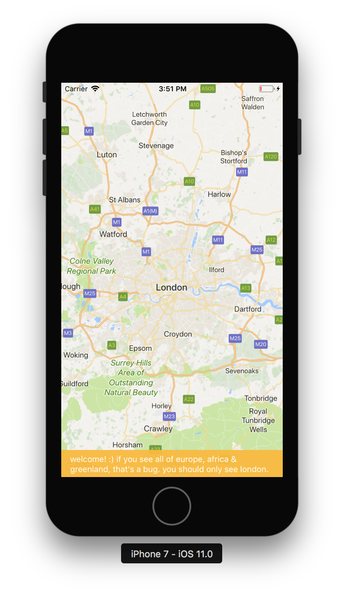
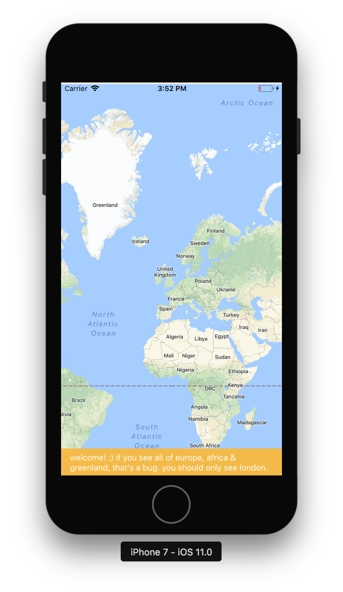

# react-native-maps Google Maps bug

**Please check out the [`debugging`](https://github.com/lachenmayer/react-native-maps-google-maps-initialregion-bug/tree/debugging) branch for a discussion of the root cause & a possible solution.**

## Observations

When using Google Maps with react-native-maps on iOS, the `initialRegion` prop is not respected.

The map is centered on the correct region, but the zoom level is incorrect, ie. the `latitudeDelta` & `longitudeDelta` values are ignored.

## Environment

| product               | version                                                                                              |
| --------------------- | ---------------------------------------------------------------------------------------------------- |
| react-native          | 0.54.2                                                                                               |
| react-native-maps     | https://github.com/react-community/react-native-maps/commit/6cc87aa5bf25f10ca1c689eed0ddb2c2e551a933 |
| Xcode                 | 9.0                                                                                                  |
| iOS                   | 11.0 (Simulator)                                                                                     |
| GoogleMaps (Pod)      | 2.5.0                                                                                                |
| Google-Maps-iOS-Utils | 2.1.0                                                                                                |

## To reproduce

1. Download the repo & open the Xcode workspace (_not_ the xcodeproj).
2. Run the project in the iOS simulator.
3. The resulting app should show a full-screen map.

_Note: This repo contains all of the required dependencies (node_modules & pods). You don't need to run `yarn/npm` or `pod install`._

## Expected behavior

You should see London:



You can trigger this behavior by changing `initialRegion` in `src/App.js` to `region`:

```diff
<View style={styles.container}>
  <MapView
    provider={PROVIDER_GOOGLE}
    style={styles.map}
-    initialRegion={{
+    region={{
      latitude: 51.50853,
      longitude: -0.12574,
      latitudeDelta: 1,
      longitudeDelta: 1,
    }}
  />
</View>
```

## Actual behavior

The map is zoomed out:


